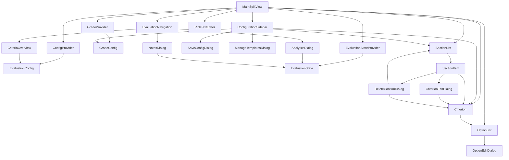

# Thesis Evaluation Tool

A web-based application for evaluating academic theses using predefined text modules and weighted scoring criteria. This tool helps evaluators assess theses across four main categories: Preface, Form, Structure, and Content, ultimately providing a grade recommendation based on weighted selections.

Access through GitHub pages: [https://marloto.github.io/evaluation-app/](https://marloto.github.io/evaluation-app/)

## Note

This overall project was created using Claude, an AI assistant developed by Anthropic. The offset was an example evaluation text as well as a set of criterions within a text document. The assistant was asked to create an app in order to help with rating. After more than 42 separated chats, this is the current result. I've never created a React, Next.js and Tailwind CSS project before, but have experiences with webdevelopment and even Angular, Vue or Svelte. This was basically an experiment in order so see where we get here. To be fair, even this README is mostly generated by the assistent.

## Features

- 📝 Structured evaluation across various categories, prefined are currently four
- 🔤 Predefined text modules for consistent evaluation
- ⚖️ Weighted scoring system
- 📊 Grade calculation based on weights
- 📈 Visual analytics and progress tracking
- 💾 Save and load evaluation templates
- 📑 Rich text notes support
- 🖨️ Print-friendly criteria overview
- 🎨 Clean, modern UI built with shadcn/ui

## Technologies

- Next.js
- React
- TypeScript
- Tailwind CSS
- shadcn/ui
- TipTap
- DnD Kit
- Recharts

## Components

The following diagram shows the main components and their relationships within this Evaluation-App.



- Providers: The `ConfigProvider`, `EvaluationStateProvider`, and `GradeProvider` manage the application's state and configuration.
- Main Components: The `MainSplitView` is the main entry point, which connects the various components like `ConfigurationSidebar`, `EvaluationNavigation`, `Criterion`, `OptionList`, `SectionList`, and `RichTextEditor`.
- Sidebar Components: The `ConfigurationSidebar` allows users to manage the application's configuration, including sections, criteria, and grade settings.
- Navigation Components: The `EvaluationNavigation` component provides an overview of the evaluation progress and access to various analysis tools.
- Editing Components: The `SectionItem`, `CriterionItem`, and `OptionEditDialog` components handle the creation, editing, and deletion of sections, criteria, and options.
- Dialog Components: The application includes various dialog components, such as `AnalyticsDialog`, `CriteriaOverview`, `NotesDialog`, and others, which provide additional functionality.
- Utility Components: The `Criterion`, `OptionList`, and `RichTextEditor` components provide specific functionality for the application.


## Getting Started

### Prerequisites

- Node.js (v18 or higher)
- npm or yarn

### Installation

1. Clone the repository:
```bash
git clone https://github.com/marloto/evaluation-app.git
```

2. Install dependencies:
```bash
cd evaluation-app
npm install
```

3. Start the development server:
```bash
npm run dev
```

4. Open [http://localhost:3000](http://localhost:3000) in your browser

### Running with Docker

You can also run the application using Docker. Pull the latest Docker image and run it:

```bash
docker pull ghcr.io/marloto/evaluation-app:latest
docker run -p 3000:3000 ghcr.io/marloto/evaluation-app:latest
```

Then, open [http://localhost:3000](http://localhost:3000) in your browser.

### GitHub Pages

You can also access the app on the GitHub Pages site:

[https://marloto.github.io/evaluation-app/](https://marloto.github.io/evaluation-app/)

### Building for Production

```bash
npm run build
```

## Usage

1. Select or create an evaluation template
2. Navigate through the four main categories:
   - Preface
   - Form
   - Structure
   - Content
3. Select appropriate criteria and ratings for each section
4. Add custom notes and text as needed
5. Review the automatically calculated grade recommendation
6. Export or save your evaluation

## Configuration

The tool supports custom configuration for:
- Evaluation criteria and weights
- Grading thresholds
- Text modules
- Templates

See the `lib/config` directory for configuration files.

## Contributing

Contributions are welcome! Please feel free to submit a Pull Request.

1. Fork the project
2. Create your feature branch (`git checkout -b feature/AmazingFeature`)
3. Commit your changes (`git commit -m 'Add some AmazingFeature'`)
4. Push to the branch (`git push origin feature/AmazingFeature`)
5. Open a Pull Request

## License

This project is licensed under the MIT License - see the [LICENSE](LICENSE) file for details.

## Contact

- GitHub Issues: https://github.com/marloto/evaluation-app/issues
- GitHub Discussions: https://github.com/marloto/evaluation-app/discussions